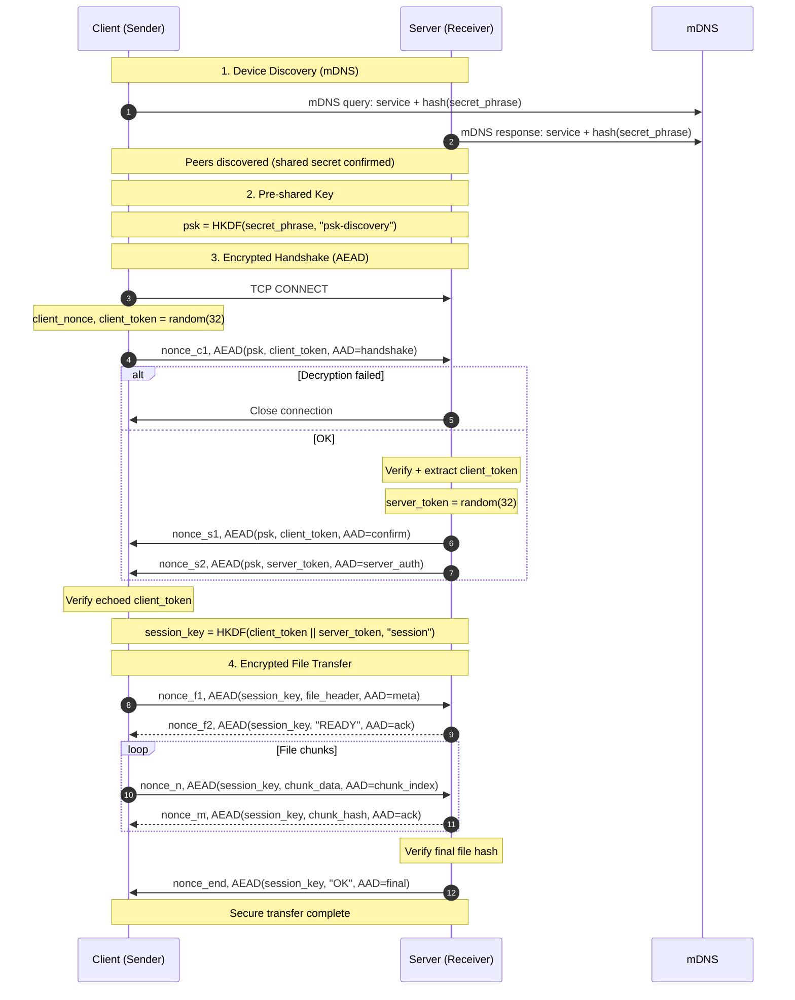

# 🦀 crab-drop

**Simple, fast, and secure file transfer over a local network.**

`crab-drop` is a CLI tool for secure peer-to-peer file transfer between two devices on the same local network.

---

## ✨ Features

- 🔐 **End-to-end encryption** (ChaCha20-Poly1305)
- 🔍 **Automatic device discovery** via mDNS
- 🔑 **Mutual authentication** using a shared secret phrase
- 📦 **Chunked file transfer** with integrity checks
- ⚡ **High-speed local transfers**

---

## 🔐 Security model

`crab-drop` uses a **pre-shared secret phrase** to:

- discover peers on the local network
- perform mutual authentication
- derive a unique session key for each transfer

The secret phrase is **never transmitted over the network in plaintext**.

### Cryptography

- **Key derivation:** HKDF
- **Authenticated encryption:** ChaCha20-Poly1305 (AEAD)
- **Session keys:** ephemeral, unique per transfer
- **Integrity:** per-chunk verification + final file hash

---

## 🧠 Protocol flow

---

## 📜 License

MIT
